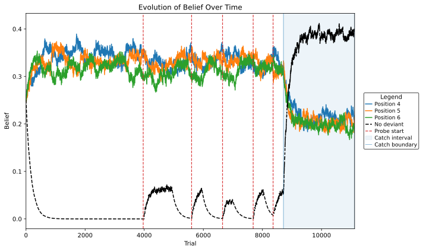

# Across-Trial-Bayesian-Belief-Updating

This repository is designed to fit multiple belief updating models to real rat behavior data for a local-global auditory oddball task. The aim is to characterize parameter level differences between wildtype and Fmr1-KO rats as well as to find minimally complex models that can explain behavioral readouts of predictive coding.

## Overview

Rats were presented an auditory detection task, where 6 beeps were presented in sequence and in positions 4 though 6 a single deviant beep occurred. In response to this deviant rats pulled their nose from a stationary port and were rewarded. The belief of where the rat throught the true deviant was recorded as an internal prior and modeled accross trials and phases. The within-trial (local) belief was modeled as a static hazard function.

Across Trial Belief Models:
- Biased 
- Unbiased 
- Change Point / Latent-phase learning 
- Omniscient / Phase-aware

## Repository Structure
/data/ : sample data excised from real raw behavior data. More information on the data requirements in data/README.md

/experiments/ : contains the executable file to generate figures and internal belief values over across trials
    - run_models.py : if additional data is inserted into the data dataframes, change the trials and days dataframes here. To run other models change the list to which models you want to run. Note doing so will remove ALL contents in the outputs/figures folder in previous iterations.

```bash
### Change parameters here
trials = pd.read_csv("data/example/Oddball_data_exported_trials.csv")
days = pd.read_csv("data/example/Oddball_data_exported.csv")
# If you add the changepoint keep in mind it takes a long time to run even given the small example dataset
model_names = ['Unbiased', 'Omniscient', 'Biased']
```

/notebooks/ : previous iterations of the internal belief updating and decision-making models. Mostly unusable.

/outputs/ : directory for output figures, CSV's, H5 files as well as sample figures for reference



/src/ : all source files related to modeling, dataframe filtering, hazard-based decision-making, and plotting
    - model files : contains functions for generating beliefs, computing log likelihood for a single run, bayesian-optimization for hyperparameters. Tune parameter bounds, change random seed & optimization iterations, and play with internal updating here.
    - dataframe_filter : raw behavior data was separated by single trial data and averaged day data that is merged through a common UUID specific to each rat's trials on a single date. Used to also adjust other properties and calculate decision bins.
    - graphing : matplotlib graphs for internal beliefs over time and calculate phase intervals
    - helper : functions to assist the executable (experiments/run_models.py)

If you are able to get run_models.py to run, you should see the bayesian optimizer working and iterating multiple times (with the exception of the omniscient model) to achieve the optimal hyperparameters for a model of a single rat. Make sure your working directory is on Across-Trial-Bayesian-Belief-Updating!


## Installation 
This project uses python 3.10. To install the required packages use the requirements.txt file.

```bash
pip install -r requirements.txt
```

Clone the repository:

```bash
git clone https://github.com/USERNAME/Across-Trial-Bayesian-Belief-Updating.git
cd file_path/Across-Trial-Bayesian-Belief-Updating
python experiments/run_models.py
```
